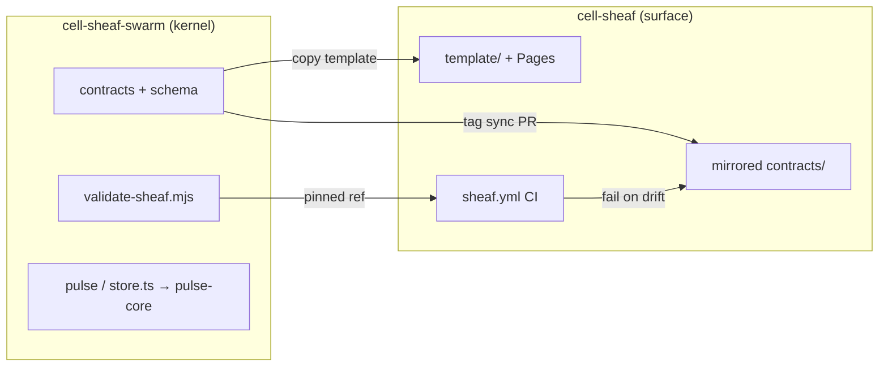
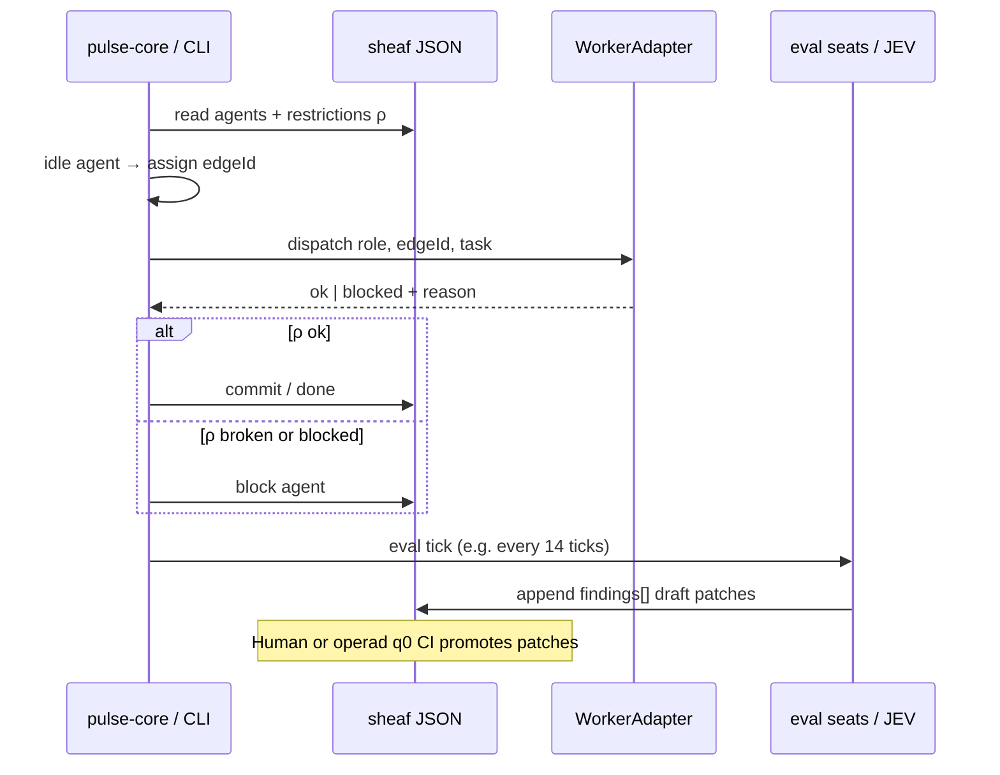

# Architecture — integrated cell-sheaf (surface view)

Concise maps for builders. Implementation authority for pulse, schema, and validate remains in [cell-sheaf-swarm](https://github.com/manutej/cell-sheaf-swarm).

## Sister repos and release bus



## Federated pulse loop (MVP)



## Evaluation harness (v0)

```mermaid
flowchart TB
  EVAL[EVAL.md four seats]
  F[findings[] on sheaf JSON]
  R[reviewer agents on eval tick]
  P[draft patch proposals]
  H[human / operad q0 gate]
  EVAL --> F
  R --> F
  F --> P
  P --> H
  H -->|promote| OK[ρ status ok on trunk]
```

## Where to read more

- [INTEGRATION.md](./INTEGRATION.md) — sync steps and CI
- [plans/2026-10-04-unified-integration-mvp-plan.md](./plans/2026-10-04-unified-integration-mvp-plan.md) — requirements and implementation units
